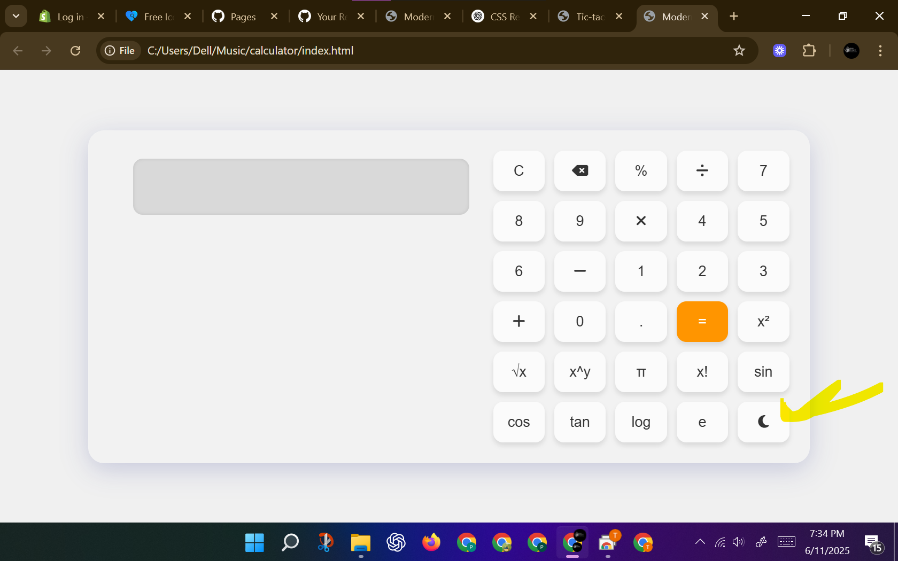

<<<<<<< HEAD
# 🔢 Modern Calculator

A stylish and functional modern calculator built using HTML, CSS, and JavaScript. Supports multiple operations with a smooth and responsive user interface.
<b>Author</b> <i>Abbasi-codes-hub</i>
🔗 **Live Preview**: [Click Here](https://abbasi-codes-hub.github.io/modern-calculator/)

---

## 📸 Screenshot

 <!-- (optional: add actual screenshot image in repo with this name) -->

---

## ⚙ Tech Stack

- HTML5
- CSS3 (Custom Styling)
- JavaScript (DOM-Based Logic)

---

## 🚀 Usage

```bash
# Clone this repository
git clone https://github.com/Abbasi-codes-hub/modern-calculator.git

# Navigate into the project folder
cd modern-calculator

# Open the index.html in your browser
=======
# modern-calculator
A modern, responsive calculator (multiple-calculations) built with HTML, CSS, and JavaScript. Designed for high calculations and explore knowledge.
>>>>>>> b26fdd660c4e3283d35dc25fcf87f7e657d12552
